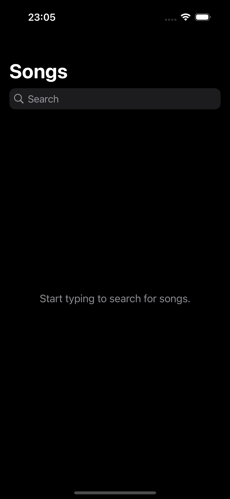
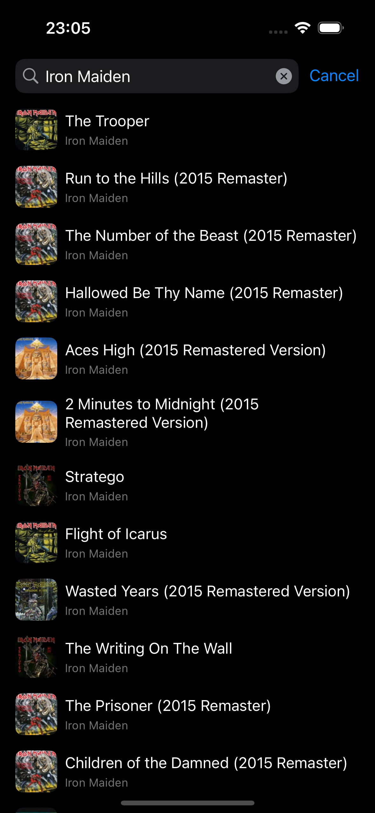
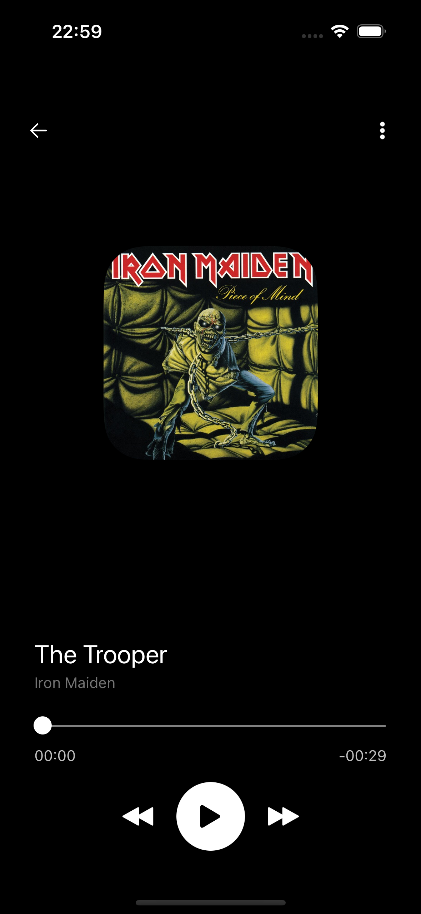
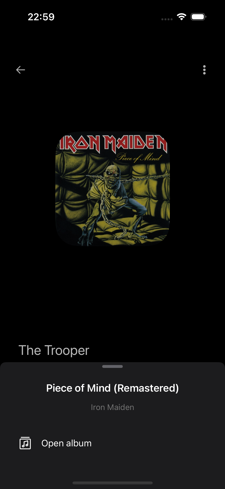
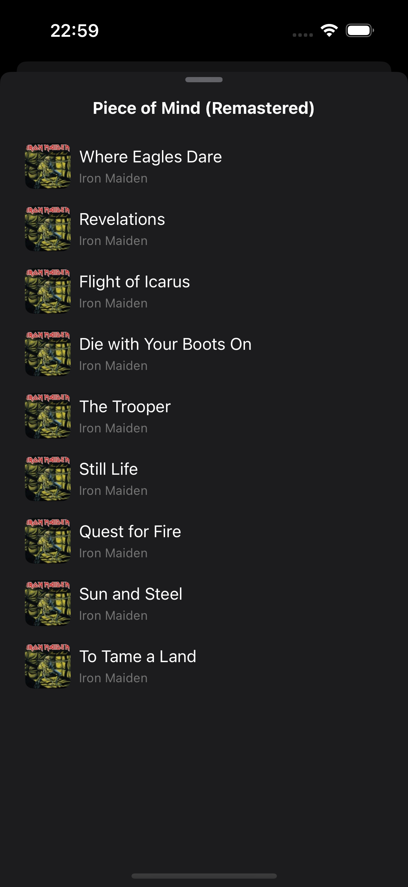

# MusicPlayer

MusicPlayer is a SwiftUI iOS app that integrates with Apple's iTunes Search API. It allows users to search for songs, view details, and listen to 30-second previews with rich album navigation and smooth pagination.

---

## Features

- **Search songs** using the iTunes Search API.
- **Song Details screen**, which includes:
  - View the **Song** name, **Artist** name, **Album** name, and the **Album** artwork.
  - **Play 30-second preview** of the selected song.
  - **Seek playback** using a slider to jump to any position in the preview.
  - **Navigate between tracks** in the album using forward and backward buttons.
- **More Options Bottom Sheet** that allows:
  - Navigating to the Album Details screen.
- **Album Details screen**:
  - Lists all songs of the album.
  - Select any song to play its preview in the Song Details screen.
- **Pagination of API results**:
  - Automatically loads more songs when reaching the end of the list, if more data exists.

---

## Screenshots

### Home Screen - Search songs

<div style="display: flex; gap: 10px; flex-wrap: wrap;">
  
  
</div>

### Song Details Screen - Playback and info with pagination



### More Options Bottom Sheet




### Album Details Screen



---

## Technical Details

- **Swift 6**: The project is fully implemented in Swift 6, leveraging its latest features and improvements.
- **MVVM Architecture Pattern**: Clear separation of concerns between UI, business logic, and data.
- **Tests Implementation**: Unit tests focused on ViewModels and the network layer to increase reliability and ensure the correctness of the app’s business logic and data handling.
- **API Results Pagination**: Seamless loading of additional data when the user scrolls to the end of song lists.
- **SOLID Principles**: Code adheres to SOLID design principles for maintainability and scalability.
- **Bitrise CI**: Automatic builds triggered on each merge to main. Pipeline available [here](https://app.bitrise.io/app/0e90ba75-ba8b-4526-b251-215f62397dbb/settings/general).

---

## Getting Started

### Requirements

- Xcode 16 or newer
- iOS 18 or newer
- Swift 6

### Setup and Run

1. Clone this repository:

```bash
git clone https://github.com/joorgeroberto/MusicPlayer.git
cd MusicPlayer
````

2. Open the project in Xcode:

```bash
open MusicPlayer.xcodeproj
```

3. Build and run the app on a simulator or a physical device.

## Architecture and Notes

- The app uses SwiftUI and Combine.
- Networking uses the iTunes Search API with pagination support.
- Audio playback is handled via AVFoundation.
- Follows MVVM architecture and SOLID design principles.

## License

This project is licensed under the MIT License. See the LICENSE file for details.

## Contact

<div style="display: flex; flex-direction: column; align-items: center; margin-top: 50px; margin-bottom: 50px;">

  <div align="center" style="margin-bottom: 30px;">
    <a href="https://github.com/joorgeroberto" target="_blank" rel="noopener noreferrer">
      
      <br />
      <sub><b>Jorge de Carvalho</b></sub>
    </a>
  </div>
  <br /><br />

  <div align="center">

  [](https://www.linkedin.com/in/jorge-de-carvalho-aa21b2186/)
  [](https://github.com/joorgeroberto)
  [](mailto:joorgeroberto@gmail.com)

  </div>

</div>
